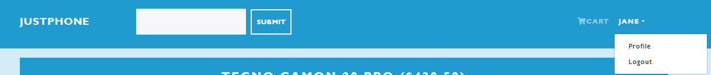
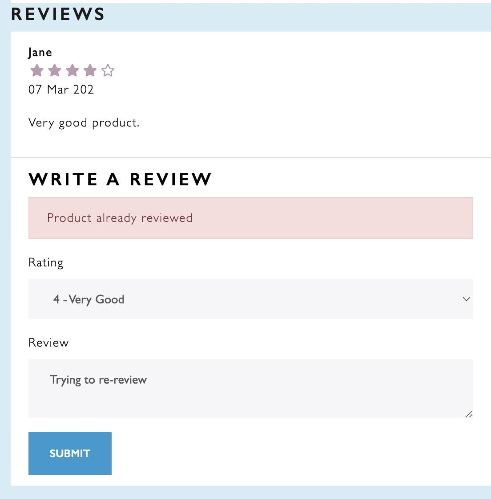
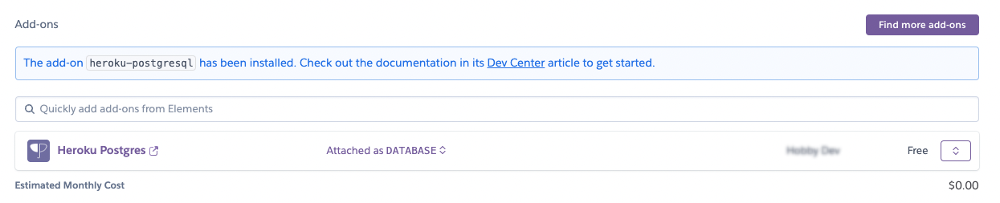

# **  justPhones | WebApp**

Welcome to 'justPhones,' your one-stop destination for the latest and greatest mobile phones, offering a curated selection of top-notch devices to meet all your communication and technology needs.

Immerse yourself in the artistry of this cutting-edge website, a masterpiece born from Portfolio Project #5 (Full-Stack Toolkit) during the esteemed Diploma in Full Stack Software Development program at [Code Institute](https://www.codeinstitute.net).

[View live website here](https://justphone-porfolio-project5-049f39193013.herokuapp.com/)


## Table of Content

- [**justPhones | WebApp**](#--justphones--webapp)
  - [Table of Content](#table-of-content)
  - [**Project**](#project)
  - [Objective](#objective)
  - [Site Users Goal](#site-users-goal)
  - [Site Owners Goal](#site-owners-goal)
  - [Project Management](#project-management)
    - [GitHub Project](#github-project)
    - [Database Schema](#database-schema)
- [**User Experience (UX)**](#user-experience-ux)
  - [Wireframes](#wireframes)
  - [User Stories](#user-stories)
    - [Site User](#site-user)
    - [Site Admin](#site-admin)
  - [Site Structure](#site-structure)
  - [User Experience](#user-experience)
  - [Design Choices](#design-choices)
- [**Features**](#features)
  - [**Existing Features**](#existing-features)
    - [**Navigation**](#navigation)
    - [**Adding Product**](#adding-product)
    - [**Update Product**](#update-product)
    - [**Profile Page**](#profile-page)
    - [**Sign Up**](#sign-up)
    - [**Sign In**](#sign-in)
    - [**Sign Out**](#sign-out)
    - [**Footer**](#footer)
    - [**Flash Messages and confirmation pages to the user**](#flash-messages-and-confirmation-pages-to-the-user)
    - [Features Left to Implement](#features-left-to-implement)
- [Technologies Used](#technologies-used)
  - [Languages](#languages)
  - [Frameworks \& Software](#frameworks--software)
  - [Libraries](#libraries)
- [Testing](#testing)
  - [Testing User Stories](#testing-user-stories)
  - [User Stories](#user-stories-1)
  - [Code Validation](#code-validation)
    - [Markup Validation](#markup-validation)
    - [CSS Validaton](#css-validaton)
    - [PEP Validation](#pep-validation)
    - [JavaScript Validation](#javascript-validation)
  - [Additional Testing](#additional-testing)
    - [Manual Testing](#manual-testing)
    - [Automated Testing](#automated-testing)
    - [Responsiveness Test](#responsiveness-test)
    - [Browser Compatibility](#browser-compatibility)
    - [Lighthouse](#lighthouse)
    - [Peer Review](#peer-review)
  - [Known bugs](#known-bugs)
    - [Fixed Bugs](#fixed-bugs)
    - [Unfixed Bugs](#unfixed-bugs)
- [Deployment](#deployment)
  - [Deployment To Heroku](#deployment-to-heroku)
  - [How To Fork The Repository On GitHub](#how-to-fork-the-repository-on-github)
  - [Cloning And Setting Up This Project](#cloning-and-setting-up-this-project)
- [Credits](#credits)
  - [Content](#content)
  - [Technical](#technical)
- [Acknowledgements](#acknowledgements)

## **Project**

## Objective

At justPhones, our core mission is to provide a captivating and interactive online space where registered users can easily browse, purchase the latest mobile phones, and share their valuable reviews on their purchases.

## Site Users Goal

The ultimate goal for users visiting the justPhones website is to seamlessly explore, purchase the latest mobile phones, and accessories while sharing their valuable reviews to enhance the shopping experience.

## Site Owners Goal

The site owner's goal for justPhones is to establish a reputable online platform that offers a wide range of top-quality mobile phones, accessories, and exceptional customer service to drive customer satisfaction and loyalty. Additionally, the owner aims to showcase the versatility and capabilities of the Full Stack Software Development skills acquired through the Diploma program at Code Institute and research.

## Project Management

### GitHub Project

I've been using the application [GitHub project](https://github.com/users/yemoalakija/projects/2). It has been working really well and has helped me structure up my work a lot.

<details><summary><b>GitHub Project</b></summary>


[User story](https://github.com/users/yemoalakija/projects/3/views/2)


</details><br/>

[Back to top](<#table-of-content>)

### Database Schema

To create an intuitive and visually appealing representation of the database schema, I utilized a powerful modeling tool called [Graph Models](https://django-extensions.readthedocs.io/en/latest/graph_models.html). This tool generates a .dot file that captures the intricate relationships between different models in our application's database. To enhance the design, I transformed the .dot file into a more user-friendly format using the dreampuf application.

<details><summary><b>Database Schema</b></summary>


</details><br/>

# **User Experience (UX)**

## Wireframes

The wireframes for the website were meticulously crafted using the [Draw.io](https://draw.io) software, encompassing desktop interface. Throughout the wireframing phase, the text content remained flexible, allowing for adjustments and improvements to enhance the final design. It's important to note that the finalized design may differ slightly from the initial wireframes, as deliberate design decisions were made to optimize aesthetics and user experience.

<details><summary><b>Wireframes</b></summary>


</details><br/>

## User Stories

The user stories for this project are presented below to provide clarity on the significance of each feature. These stories serve as a foundation for testing and validation, which will be thoroughly documented and confirmed in the subsequent [Testing](<#testing>).

### Site User
|  | | |
|:-------:|:--------|:--------|
| As a Site User | [I can view a list of available mobile phones](https://github.com/users/yemoalakija/projects/3/views/2?pane=issue&itemId=58849389) | &check; |
| As a Site User | [I can search for a specific mobile phone](https://github.com/users/yemoalakija/projects/3/views/2?pane=issue&itemId=58898510) | &check; |
| As a Site User | [I can view the details of a specific mobile phone](https://github.com/users/yemoalakija/projects/3/views/2?pane=issue&itemId=58898514) | &check; |
| As a Site User | [I can add a mobile phone to my cart](https://github.com/users/yemoalakija/projects/3/views/2?pane=issue&itemId=58898521) | &check; |
| As a Site User | [I can view the items in my cart](https://github.com/users/yemoalakija/projects/3/views/2?pane=issue&itemId=58898525) | &check; |
| As a Site User | [I can proceed to checkout and make a purchase](https://github.com/users/yemoalakija/projects/3/views/2?pane=issue&itemId=58898533) | &check; |
| As a Site User | [I can create an account to save my personal information](https://github.com/users/yemoalakija/projects/3/views/2?pane=issue&itemId=58898538) | &check; |
| As a Site User | [I can be sure that my personal details are safe when purchasing from the site](https://github.com/users/yemoalakija/projects/3/views/2?pane=issue&itemId=58898541) | &check; |
| As a Site User | [I can view my order history](https://github.com/users/yemoalakija/projects/3/views/2?pane=issue&itemId=58898552) | &check; |
| As a Site User | [I can leave a review for a purchased mobile phone](https://github.com/users/yemoalakija/projects/3/views/2?pane=issue&itemId=58898556) | &check; |
| As a Site User | [I can log out from the site](https://github.com/users/yemoalakija/projects/3/views/2?pane=issue&itemId=58898572) | &check; |
| As a Site User | [I can receive visual feedback when interacting with the site](https://github.com/users/yemoalakija/projects/3/views/2?pane=issue&itemId=58898580) | &check; |

### Site Admin

|  | | |
|:-------:|:--------|:--------|
| As a Site Admin | I can log out from the site so that I can feel safe that nobody can access my information | &check; |
| As a Site Admin | I can create, update and delete products as well as user account | &check; |
| As a Site Admin | I can approve users orders/purchases | &check; |
| As a Site Admin | I can access an admin area so that I can get a general understanding of logged in users, number of order and purchases | &check; |
| As a Site Admin | I can get visual feedback when interacting with the content so that I can be sure how I have interacted with the page | &check; |

[Back to top](<#table-of-content>)

## Site Structure

## User Experience

justPhones is divided into two parts: **when the user is logged out** and **when the user is logged in**. Depending on the login status, different pages are available for the user. When the user is logged out, they can only view products and product ratings but cannot perform any of the mentioned activities, except when logged in. If you are logged in as an administrator, an *`admin` area* is available to perform CRUD functionalities. The site features a minimalistic, clean, and intuitive design that makes it easy to navigate for the user.

Read more about the different choices in the [Features](<#features>) section.

[Back to top](<#table-of-content>)

## Design Choices

* ### Color Scheme

The color scheme chosen for justPhones site was based on Bootstrap colour scheme and my personal reference.

<details><summary><b>Color Scheme</b></summary>


</details><br />

* ### Typography

The fonts used for the site is `Trebuchet MS`, which is sans-serif.

* `Trebuchet` is used generally in the website with different weights as needed. It's easy to read and matches the minimalistic style that I wanted the site to have.

<details><summary><b>Trebuchet - Font</b></summary>


</details>

[Back to top](<#table-of-content>)

# **Features**

The features of the site are listed below.

## **Existing Features**

### **Navigation**

The navigation bar is very clean and straight forward. Depending if you  are logged in or not different menus are visible for the site user. If a user login, the user has the ability to place other, review products etc. An extra menu item is visible if you are logged in as an `administrator`.

*Links that are visible to logged out users**

* `Home` - The home page and list of available products.
* `Search` - Search button, to search for a specific brand in mind.
* `Login` / `Sign Up` - Gives the user the opportunity to log in or sign up if not already a registered user at justPhones.

<details><summary><b>Navigation - User Not Logged In</b></summary>


</details>

<details><summary><b>Navigation - Small Screen User Not Logged In</b></summary>


</details><br/>

*Links that are visible to logged in users*

All of the links that are visible to a not logged in user plus the ones below.

* `Profile` Page - Shows the profile page of the logged-in user.
* `Logout` - Logs out the user from the justPhones application.

<details><summary><b>Navigation - User Logged In</b></summary>


</details>

<details><summary><b>Navigation - Small Screen User Not Logged In</b></summary>


</details><br/>

*Links that are visible if a user is an administrator*

All of the links above plus the one below.

* Admin Area - Gives the administrator a view with information about i.e. total number of users, number of comments and number of posts. In this view the administrator also can `delete a user account` / `make a user an admin` / `purchase` / `review`, `add products` / and `delete products`.

<details><summary><b>Navigation - Admin Logged In</b></summary>


</details><br/>

### **Adding Product**

An `admin` add products by clicking on the `+CREATE PRODUCT` `button`, then it goes to the page where to add a product along with other details as shown below:

<details><summary><b>Admin Product Adding Page</b></summary>


</details>

### **Update Product**

To update a product, the `admin` clicks on the `edit` icon at the front of the product then it will take the `admin` to the product `update` page as shown below:

<details><summary><b>Product Update</b></summary>


</details>

### **Profile Page**

On this page the user can view and update their own profile page. And update passwords. Also see their orders.

<details><summary><b>User Profile Page</b></summary>


</details><br/>

### **Sign Up**

If the site visitor has no registered user at justPhones, they can sign up.

<details><summary><b>Sign Up</b></summary>


</details><br/>

### **Sign In**

On this page the user can sign in to justPhones website.

<details><summary><b>Sign In</b></summary>


</details><br/>

### **Sign Out**

The logout is carefully crafted, once clicked on, it logout the user.

<details><summary><b>Logout</b></summary>


</details><br/>

### **Footer**

The footer area includes short information about justPhones builder.

<details><summary><b>Footer</b></summary>


</details><br/>

### **Flash Messages and confirmation pages to the user**

The sites incorporates flash messages and confirmation pages before and when an action has been performed.

<details><summary><b>Confirmation Messages</b></summary>





</details><br/>

### Features Left to Implement

* Add more automated testing
* User ability to delete owned account
* User edit and update review
* User ability to delete/cancle product order after getting to payment page
* And few other features to be explored after

[Back to top](<#table-of-content>)

# Technologies Used

## Languages

* [Python](https://en.wikipedia.org/wiki/Python_(programming_language)) - Provides the functionality for the site.
* [HTML5](https://en.wikipedia.org/wiki/HTML) - Provides the content and structure for the website.
* [CSS3](https://en.wikipedia.org/wiki/CSS) - Provides the styling for the website.
* [JavaScript](https://en.wikipedia.org/wiki/JavaScript) - Provides interactive elements of the website

## Frameworks & Software

* [Bootstrap](https://getbootstrap.com/) - A CSS framework that helps building solid, responsive, mobile-first sites
* [Django](https://www.djangoproject.com/) - A model-view-template framework
used to create the justPhones template.
* [Draw.io](https://draw.io/) - Used to create the wireframe.
* [Github](https://github.com/) - Used to host and edit the website.
* [GitBash](https://en.wikipedia.org/wiki/Bash_(Unix_shell)) - Terminal in [GitHub Codespace](https://www.github.com) used to create, edit and push changes to the GitHub repository.
* [Heroku](https://en.wikipedia.org/wiki/Heroku) - A cloud platform that the application is deployed to.
* [Lighthouse](https://developer.chrome.com/docs/lighthouse/overview/) - Used to test performance of site.
* [Am I Responsive](https://www.amresponsive.com/) - Used for responsiveness check.
* [Graph Models](https://django-extensions.readthedocs.io/en/latest/graph_models.html) - Used to create a *.dot file of all models in the project.
* [Favicon](https://favicon.io/) - Used to create the favicon.
* [Google Chrome DevTools](https://developer.chrome.com/docs/devtools/) - Used to debug and test responsiveness.
* [Cloudinary](https://cloudinary.com/) - A service that hosts all static files in the project.
* [HTML Validation](https://validator.w3.org/) - Used to validate HTML code
* [CSS Validation](https://jigsaw.w3.org/css-validator/) - Used to validate CSS code
* [PEP8 Validation](http://pep8online.com/) - At the time for deploying this project the PEP8 Online Validaton service was offline, therefore not used.
* [JSHint Validation](https://jshint.com/) - Used to validate JavaScript code

## Libraries

[Back to top](<#table-of-content>)

The libraries used in this project are located in the requirements.txt and package.json in the frotntend director and have been documented below

Backend Libraries:

* [asgiref](https://pypi.org/project/asgiref/) - ASGI is a standard for Python asynchronous web apps and servers to communicate with each other, and positioned as an asynchronous successor to WSGI.
* [cloudinary](https://pypi.org/project/cloudinary/) - The Cloudinary Python SDK allows you to quickly and easily integrate your application with Cloudinary. Effortlessly optimize, transform, upload and manage your cloud's assets.
* [dj3-cloudinary-storage](https://pypi.org/project/dj3-cloudinary-storage/) - Django Cloudinary Storage is a Django package that facilitates integration with Cloudinary by implementing Django Storage API.
* [Django](https://pypi.org/project/Django/) - Django is a high-level Python web framework that encourages rapid development and clean, pragmatic design.
* [django-allauth](https://pypi.org/project/django-allauth/) - Integrated set of Django applications addressing authentication, registration, account management as well as 3rd party (social) account authentication.
* [django-resized](https://pypi.org/project/django-resized/) - Used to integrate image resiziing to specified size in the project.
* [django-extensions](https://pypi.org/project/django-extensions/) - Django Extensions is a collection of custom extensions for the Django Framework.
* [gunicorn](https://pypi.org/project/gunicorn/) - Gunicorn ‘Green Unicorn’ is a Python WSGI HTTP Server for UNIX. It’s a pre-fork worker model ported from Ruby’s Unicorn project. The Gunicorn server is broadly compatible with various web frameworks, simply implemented, light on server resource usage, and fairly speedy.
* [oauthlib](https://pypi.org/project/oauthlib/) - OAuthLib is a framework which implements the logic of OAuth1 or OAuth2 without assuming a specific HTTP request object or web framework.
* [psycopg2](https://pypi.org/project/psycopg2/) - Psycopg is the most popular PostgreSQL database adapter for the Python programming language.
* [PyJWT](https://pypi.org/project/PyJWT/) - A Python implementation of RFC 7519.
* [python-dotenv](https://pypi.org/project/python-dotenv/) - Python-dotenv has been used in this project to store the environmental variables. For it simple and concise usage.
* [pylint-django-2.5.3](https://pypi.org/project/pylint-django/) - A Pylint plugin for improving code analysis when analysing code using Django.
* [requests-oauhlib](https://pypi.org/project/requests-oauthlib/) - P    rovides first-class OAuth library support for Requests.
* [sqlparse](https://pypi.org/project/sqlparse/) - sqlparse is a non-validating SQL parser for Python. It provides support for parsing, splitting and formatting SQL statements.
* [cryptography-3.3.23](https://pypi.org/project/cryptography/3.3/) - Cryptography is a package which provides cryptographic recipes and primitives to Python developers.
* [whitenoise](https://whitenoise.readthedocs.io/en/latest/) - Whitenoise, radically simplified static file serving for Python web apps. I used this to serve the static files in this project.

Frontend Libraries:

* [jest-dom](https://jest.dev/) - Jest-DOM is a library for testing React components that provides custom matchers for DOM elements.
* [react](https://react.dev/) - React is a JavaScript library for building web and native user interfaces using components.
* [axios](https://axios.dev/) - Axios is a popular library for making HTTP requests from the browser or Node.js.
* [react-bootstrap](https://react-bootstrap.dev/)- React-Bootstrap is a library that provides Bootstrap components as React components.
* [react-dom](https://react.dev/): - ReactDOM is the package that allows React to interact with the DOM in web applications.
* [react-paypal-button-v2](https://paypal.github.io/react-paypal-button-v2) - React-Paypal-Button-V2 is a library for integrating PayPal buttons into React applications.
* [react-redux](https://react-redux.js.org/) - React-Redux is the official Redux binding for React, enabling seamless integration of Redux with React components.
* [react-router-bootstrap](https://reactrouter.com/web/guides/quick-start) - React-Router-Bootstrap provides integration between React Router and Bootstrap for navigation in React applications.
* [react-router-dom](https://reactrouter.com/web/guides/quick-start) - React-Router-DOM is the DOM bindings for React Router, enabling routing in single-page applications.
* [react-scripts](https://create-react-app.dev/docs/getting-started/) - React-Scripts are scripts and configurations used by Create-React-App to build and run React applications.
* [redux](https://redux.js.org/) Redux is a predictable state container for JavaScript apps, often used with React to manage application state.
* [redux-devtools-extension](https://github.com/zalmoxisus/redux-devtools-extension) - Redux DevTools Extension is a tool that allows you to inspect and debug Redux state changes in your application.
* [redux-thunk](https://github.com/reduxjs/redux-thunk) Redux Thunk is a middleware that allows you to write action creators that return functions instead of plain objects.
* [web-vitals](https://web.dev/vitals/) Web Vitals are essential metrics related to user experience on the web, focusing on loading speed, interactivity, and visual stability.

# Testing

## Testing User Stories

## User Stories

| User Type      | User Story      | Completed |
|----------------|-----------------------|-----------|
| Site User      | View a list of products                                                                             | &check;   |
| Site User      | View the details of a specific product                                                              | &check;   |
| Site User      | Add products to cart                                                                                | &check;   |
| Site User      | View the number of items in cart                                                                    | &check;   |
| Site User      | Navigate through a paginated list of products                                                       | &check;   |
| Site User      | Search for products based on specific criteria                                                      | &check;   |
| Site User      | Create an account                                                                                   | &check;   |
| Site User      | Leave reviews and ratings for products                                                              | &check;   |
| Site Admin     | Manage inventory of products                                                                        | &check;   |
| Site Admin     | Manage user orders                                                                                  | &check;   |
| Site Admin     | Manage user accounts                                                                                | &check;   |
| Site Admin     | Manage customer support requests                                                                    | &check;   |

## Code Validation

The code on the 'justPhones' site has been tested through W3C Markup Validation Service, W3C CSS Validation Service and JSHint. Errors were at first found on the site in the W3C Markup Validation Service but could quite easily be fixed (see bugs section).

### Markup Validation

After fixing the inital errors that W3C Markup Validation Service reported, no errors were returned.

<details><summary><b>HTML Validation Result</b></summary>


</details><br/>

[Back to top](<#table-of-content>)

### CSS Validaton

Some Bootstrap errors were found in the css file as shown below.

<details><summary><b>CSS Validation Result</b></summary>


</details><br/>

[Back to top](<#table-of-content>)

### PEP Validation

No errors report was found in all the python files.

[Back to top](<#table-of-content>)

### JavaScript Validation

The JSHint validator results can be seen below:

<details><summary><b>JSHint Validation Result</b></summary>


</details><br/>

[Back to top](<#table-of-content>)

## Additional Testing

### Manual Testing

In addition to tests stated above I have performed a few manual tests. Below the list of tests that has been conducted can be found.

| Status | **Main Website - User Logged Out**
|:-------:|:--------|
| &check; | Typing in a incorrect URL on the page loads the 404 error page
| &check; | Pasting page that needs authentication loads a forbidden page
| &check; | Clicking the nav logo loads the home page

| Status | **Main Website - User Logged In**
|:-------:|:--------|
| &check; | Typing in a incorrect URL on the page loads the 404 error page
| &check; | Pasting page that needs authentication loads a forbidden page
| &check; | Clicking the nav logo loads the home page
| &check; | Clicking the Home button on the nav bar loads the home page and lists all blogs
| &check; | In the product detail view the logged in user can write review on a product
| &check; | In the logged in user menu the Admin Area is not visible
| &check; | Clicking the Show Profile Page button in the logged in user menu loads the My Profile page

| Status | **Main Website - Admin Logged In**
|:-------:|:--------|
| &check; | Clicking the Admin Area button in the logged in user menu loads the Admin Area Page
| &check; | In the users section, an `admin` can delete/register a user
| &check; | Total Users shows correct number of total users

Status | **Create A New User - User Logged Out**
|:-------:|:--------|
| &check; | Username field is required
| &check; | Username field does not accept empty field
| &check; | Email field does not accept just spaces
| &check; | Password field does not accept empty field
| &check; | Success flash message is displayed when the user submits the create a new user form

### Automated Testing

Some automated testing has been done during this project. Due to prioritization of other tasks I only could provide few coverage. See screenshot below. Automated tests can be run by typing the command - *`python manage.py test`*

<details><summary><b>Automated Testing</b></summary>


</details><br/>

### Responsiveness Test

The responsive design tests were carried out manually with [Google Chrome DevTools](https://developer.chrome.com/docs/devtools/) and [Responsive Design Checker](https://www.responsivedesignchecker.com/).

| Desktop    | Display <1280px       | Display >1280px    |
|------------|-----------------------|--------------------|
| Render     | pass                  | pass               |
| Images     | pass                  | pass               |
| Links      | pass                  | pass               |

| Tablet     | Samsung Galaxy Tab 10 | Amazon Kindle Fire | iPad Mini | iPad Pro |
|------------|-----------------------|--------------------|-----------|----------|
| Render     | pass                  | pass               | pass      | pass     |
| Images     | pass                  | pass               | pass      | pass     |
| Links      | pass                  | pass               | pass      | pass     |

| Phone      | Galaxy S5/S6/S7       | iPhone 6/7/8       | iPhone 12pro         |
|------------|-----------------------|--------------------|----------------------|
| Render     | pass                  | pass               | pass      | pass     |
| Images     | pass                  | pass               | pass      | pass     |
| Links      | pass                  | pass               | pass      | pass     |

[Back to top](<#table-of-content>)

### Browser Compatibility

* `Google Chrome` Version (122.0.6261.29)
* `Mozilla Firefox` (version 122.0)
* `Apple Safari` (version 16.6)
* `Microsoft Edge` (version 121.0.2277.113)

[Back to top](<#table-of-content>)

### Lighthouse

Google Lighthouse in Chrome Developer Tools was used to test the application within the areas of *Performance*, *Accessibility*, *Best Practices* and *SEO*.

<details><summary><b>Lighthouse Result</b></summary>


</details><br/>

[Back to top](<#table-of-content>)

### Peer Review

Additional testing of the application was conducted by people outside of the software development field. Some smaller spelling and grammar errors were found and corrected. No issues connected to design or handling of the site.

## Known bugs

  - manifest.json file, complain missing in the console but it's in the project
  - Some other console errors too but nothing much to worry about as they're generated by the browser

### Fixed Bugs

**Bugs:**

  - Whitehouse refused to render the template in production. I tackled this issue by conducting extensive research on platforms like Stack Overflow and Google, as well as seeking guidance from my knowledgeable copilot friend.

  - Integrating PayPal into the project posed numerous challenges. However, I successfully resolved the issue using the same approach as before.

### Unfixed Bugs

* None as at when doing the project.

<details><summary><b>CSS Validation</b></summary>


</details><br />

<details><summary><b>Warnings from Google Chrome DevTools</b></summary>


</details><br />

[Back to top](<#table-of-content>)

# Deployment

## Deployment To Heroku

The project was deployed to [Heroku](https://www.heroku.com). To deploy, please follow the process below:

1. To begin with, we need to create a GitHub repository from the [this repo](https://github.com/yemoalakija/just-phone.git) by following the link and then click 'Use this template'.

<details><summary><b>Heroku Deployment - Step 1</b></summary>


</details><br />

2. Fill in the needed details as stated in the screenshot below and then click 'Create Repository From Template'.

<details><summary><b>Heroku Deployment - Step 2</b></summary>


</details><br />

3. When the repository creation is done click 'GitHub' as stated in the screenshot below to create a codespace.

<details><summary><b>Heroku Deployment - Step 3</b></summary>


</details><br />

4. Now it's time to install Django and the supporting libraries that are needed. Type the commands below to do this.

* ```pip install 'django<4' gunicorn```
* ```pip install 'dj_database_url psycopg2```
* ```pip install 'dj3-cloudinary-storage```

<details><summary><b>Heroku Deployment - Step 4</b></summary>


</details><br />

5. When Django and the libraries are installed we need to create a requirements file.

* ```pip freeze --local > requirements.txt``` - This will create and add required libraries to requirements.txt

<details><summary><b>Heroku Deployment - Step 5</b></summary>


</details><br />

6. Now it's time to create the project.

* ```django-admin startproject YOUR_PROJECT_NAME .``` - This will create your project

<details><summary><b>Heroku Deployment - Step 6</b></summary>


</details><br />

7. When the project is created we can now create the application.

* ```python manage.py startapp APP_NAME``` - This will create your application

<details><summary><b>Heroku Deployment - Step 7</b></summary>


</details><br />

8. We now need to add the application to settings.py

<details><summary><b>Heroku Deployment - Step 8</b></summary>


</details><br />

8. Now it is time to do our first migration and run the server to test that everything works as expected. This is done by writing the commands below.

* ```python manage.py migrate``` - This will migrate the changes
* ```python manage.py runserver``` - This runs the server. To test it, click the open browser button that will be visible after the command is run.

9. Now it is time to create our application on Heroku, attach a database, prepare our environment and settings.py file and setup the Cloudinary storage for our static and media files.

* Head on to [Heroku](https://www.heroku.com/) and sign in (or create an account if needed).

* In the top right corner there is a button that is labeled 'New'. Click that and then select 'Create new app'.

<details><summary><b>Heroku Step 09</b></summary>


</details><br />

10. Now it's time to enter an application name that needs to be unique. When you have chosen the name, choose your region and click 'Create app".

<details><summary><b>Heroku Step 10</b></summary>


</details><br />

11. To add a database to the app you need to go to the resources tab ->> add-ons, search for 'Heroku Postgres' and add it.

<details><summary><b>Heroku Step 11</b></summary>



</details><br />

12. Go to the settings tab and click on the reveal Config Vars button. Copy the text from `DATABASE_URL` (because we are going to need it in the next step).

<details><summary><b>Heroku Step 12</b></summary>


</details><br />

13. Go back to your codespace and create a new `.env` file in the top level directory. Then add these rows.

* ```DATABASE_URL = "YOUR_DATABASE_URL"``` - This sets the environment variables.
* ```SECRET_KEY = "YOUR_SECRET_KEY"``` - Here you can choose whatever secret key you want.
* ```CLOUDINARY_URL = "YOUR_CLOUDINARY_URL"``` - Cloudinary connection string.

<details><summary><b>Heroku Step 13</b></summary>


</details><br />

14.  Now we are going to head back to Heroku to add the specified environemnt variables to config vars. See screenshot below.

<details><summary><b>Heroku Step 14</b></summary>


</details><br />

15. Now we have some preparations to do connected to our environment and settings.py file. In the settings.py, add the following code:

```import os```

```import dj_database_url```

```from dotenv import load_dotenv```

```load_dotenv()```

<details><summary><b>Heroku Step 15</b></summary>


</details><br />

16. In the settings file, remove the insecure secret key and replace it with:
```SEECRET_KEY = os.getenv('SECRET_KEY')```

<details><summary><b>Heroku Step 16</b></summary>


</details><br />

17.  Now we need to comment out the old database setting in the settings.py file (this is because we are going to use the postgres database instead of the sqlite3 database).

<details><summary><b>Heroku Step 17 1/2</b></summary>


</details><br />

Now, add the link to the DATABASE_URL that we added to the environment file earlier.

<details><summary><b>Heroku Step 17 2/2</b></summary>


</details><br />

18. Save all your fields and migrate the changes.

```python manage.py migrate```

19. Now we are going to get our connection to Cloudinary connection working (this is were we will store our static files). First you need to create a Cloudinary account and from the Cloudinary dashboard copy the API Environment Variable.

20. Go back to the `.env` file in our codespace and add the Cloudinary url as said No.13 above (it's very important that the url is correct):

```CLOUDINARY_URL = "cloudinary://************************"```

21. Let's head back to Heroku and add the Cloudinary url in Config Vars. We also need to add a disable collectstatic variable to get our first deployment to Heroku to work.

<details><summary><b>Heroku Step 21</b></summary>


</details><br />

22. Let's head back to our settings.py file on codespace. We now need to add our Cloudinary Libraries we installed earlier to the installed apps. Here it is important to get the order correct.

<details><summary><b>Heroku Step 22</b></summary>


</details><br />

23. For Django to be able to understand how to use and where to store static files we need to add some extra rows to the settings.py file and relate it to the frontend (React build static files) since we're deploying our app in one domain.

<details><summary><b>Heroku Step 23</b></summary>


</details><br />

24. Almost there, we have just a couple of steps left. Now it's time to link the file to the Heroku templates directory.

<details><summary><b>Heroku Step 24</b></summary>


Then we set the below in `urls.py` files for Django to serve React build static.


</details><br />

25. Let's change the templates directory to `TEMPLATES_DIR` in the teamplates array.

<details><summary><b>Heroku Step 25</b></summary>


</details><br />

26. To be able to get the application to work through Heroku we also need to add our Heroku app and localhost to which hosts that are allowed.

<details><summary><b>Heroku Step 26</b></summary>


</details><br />

27. For this project, we'll use `whitenoise` package to take care of our staticfiles.

* ```pip install whitenoise```
* We need to install middleware, add:

  ```bash

  MIDDLEWARE = [
    # ...other middlewares
    'whitenoise.middleware.WhiteNoiseMiddleware',]

* Configure static files:
  ```bash
  STATIC_URL = '/static/'
  STATICFILES_DIR = [
    os.path.join(BASE_DIR / 'frontend/build')
  ]
  STATIC_ROOT = os.path.join(BASE_DIR / 'static')
  STATICFILES_STORAGE = 'whitenoise.storage.CompressedManifestStaticFilesStorage'

* We run: `python manage.py collectstatic` for whitenoise to takecare of the static files of the project.
* Create a file called **`Procfile`* and add the line ```web: gunicorn PROJ_NAME.wsgi?``` to it.d

1.   Now you can save all the files and prepare for the first commit and push to Github by writing the lines below.

* ```git add .```
* ```git commit -m "Deployment Commit```
* ```git push```

29. Before moving on to the Heroku deployment we just need to add one more thing in the config vars. We need to add `PORT` in the KEY input field and `8000` in the VALUE field. If we don't add this there might be problems with the deployment.

30. Now it's time for deployment. Scroll to the top of the settings page in Heroku and click the 'Deploy' tab. For deployment method, select `GitHub`. Search for the repository name you want to deploy and then click connect.

31. Scroll down to the manual deployment section and click `Deploy Branch`. Hopefully the deployment is successful!

<details><summary><b>Heroku Step 31</b></summary>


</details><br />

The live link to the `justPhones` site on Heroku an be found [here](https://justphone-porfolio-project5-049f39193013.herokuapp.com). And the Github repository can be found [here](https://github.com/yemoalakija/just-phone).

[Back to top](<#table-of-content>)

## How To Fork The Repository On GitHub

It is possible to do a independent copy of a GitHub Repository by forking the GitHub account. The copy can then be viewed and it is also possible to do changes in the copy without affecting the original repository. To fork the repository, take these steps:

1. After logging in to GitHub, locate the repository. On the top right side of the page there is a `Fork` button. Click on the button to create a copy of the original repository.

<details><summary><b>Github Fork</b></summary>


</details><br />

[Back to top](<#table-of-content>)

## Cloning And Setting Up This Project

To clone and set up this project, follow the steps below:

1. Open the repository and click on the "Code" tab.
2. In the dropdown menu, click on the "Clone" button and copy the repository URL.
3. Open your preferred IDE and navigate to the directory where you want to clone the project.
4. Open Git Bash and run the command `git clone [repository URL]` to create a local clone.

<details><summary><b>GitHub Clone</b></summary>


</details><br />

5. Navigate to the `frontend` directory and run `npm install` to set up the required node_modules. Then, go back to the parent directory where the backend files are located.

6. Install the project requirements by running the command:

* ```pip install -r requirements.txt``` - This command downloads and install all required dependencies that is stated in the requirements file.
  Note: You can as well setup a virtual environment before installing the `requirements.txt` file:
    * In your local machine of IDE, in the directory where the repo is cloned, run: `python -m venv "YOUR_VIRTUAL_ENVIRONMENT_NAME"` The `virtual_envronemnt_name` can be any name you want. Then you need to activate the envronment by running: `.\VIRTUAL_ENV_NAME\Script\activate` on windows or `source VIRTUAL_ENV_NAME/bin/activate` on macOS. Type `deactivate` to stop the virtual environment.

7. The next step is to set up the environment file so that the project knows what variables that needs to be used for it to work. Environment variables are usually hidden due to sensitive information. It's very important that you don't push the `.env` file to Github (this can be secured by adding `.env` to the .gitignore-file). The variables that are declared in the `.env` file needs to be added to the Heroku config vars. Don't forget to do necessary migrations before trying to run the server.

* ```python manage.py migrate``` - This will do the necessary migrations.
* ```python manage.py runserver```

`cd` to the frontend directory and run `npm start` to start the frontend local server - If everything is setup correctly the project is now live locally.

<details><summary><b>Setup .env</b></summary>


</details><br />

[Back to top](<#table-of-content>)

# Credits

## Content

* All text content written by Adeyemo Alakija.

* Product images taken from [Google](https://www.google.com) as well as respective official product sites.

* Template for read.me provided by Code Institute (*with some additional changes that my mentor [Precious Ijege](https://www.linkedin.com/in/precious-ijege-908a00168/))* suggested.

## Technical

* This project drew inspiration from Travis e-commerce project and my personal passion for creating a streamlined online store where customers can purchase phones and gadgets. The implementation of the `paypal api` allows for secure and convenient payment processing.

* I am committed to continuously enhancing and expanding the functionality of this project in the future. Thank you for your support.

# Acknowledgements

This site was created for educational purposes and as part of Portfolio Project #5 (Full-Stack Tolkin) for the Diploma in Full Stack Software Development at the [Code Institute](https://www.codeinstitute.net). I would like to express my gratitude to my mentor [Precious Ijege](https://www.linkedin.com/in/precious-ijege-908a00168/) for providing valuable feedback throughout the project.

*Adeyemo Alakija, 2024*

[Back to top](<#table-of-content>)
